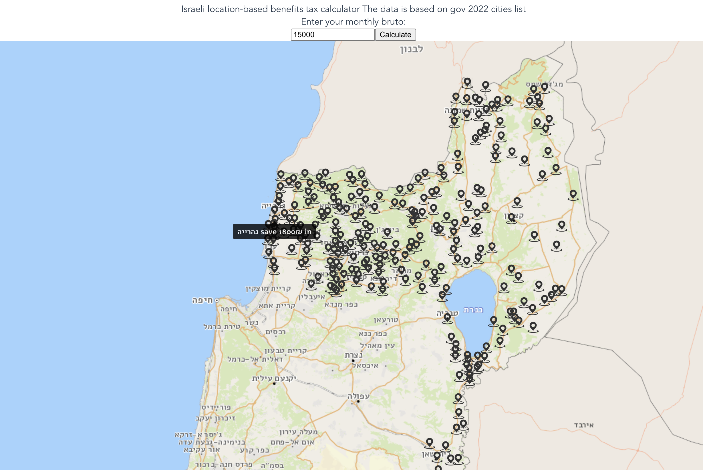

# tax-benefits-map
## Israeli location-based benefits tax calculator

- The data is based on gov 2022 cities list
- Unfortunately gov maps API is only free from localhost domain so I couldnt publish it to pages :( adding docker instead:

```console
docker run -p 8080:80 efrat19/tax-benefits-map:latest
open http://localhost:8080
```



Enjoy!
